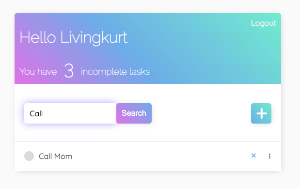

# Django-Todos

<p align="center">
  
  <h1 style="text-align: center;">Stay on Task in style</h1>
</p>


# Inspiration

What a better way to learn about a technology than to learn by creating a todo app. Making the todo app was fun deploying it to heroku was not. But I prevailed. Checkout the deploy here <a href="https://py-dj-todos.herokuapp.com//login/?next=/" target="_blank">Django-Todos</a>


# Features

- Create User Account
- Login to User Account
- Add Task
- Edit Task
- Delete Task
- View Tasks
- Search Tasks


# Installation

First clone this repo

```shell
git clone git@github.com:livingkurt/Django-Todos.git
```


Set up Virtual Envirnment

```shell
python -m venv venv
```

Activate Virtual Envirnment

```shell
source venv/bin/activate
```

Install Dependencies

```shell
pip install -r requirements.txt
```

Set up database using your credencials

```shell
DATABASES = {
    'default': {
        'ENGINE': 'django.db.backends.postgresql_psycopg2',
        'NAME': 'db_name',
        'USER': 'name',
        'PASSWORD': '',
        'HOST': 'localhost',
        'PORT': '',
    }
}
```
Migrate your database

```shell
python manage.py migrate
```

Create admin for database to access admin panel

```shell
python manage.py createsuperuser
```

Make Migrations

```shell
python manage.py makemigrations
```

Migrate again

```shell
ppython manage.py migrate
```

Start up server

```shell
python manage.py runserver
```

## Accessing Admin Panel

Once server is running, go to

```shell
http://localhost:8000/admin/
```
You will be prompted for your superuser creditials.

# Pictures

<div align="center" style="display:flex; flex-direction: column; flex-wrap: wrap;">
<div>
  <h2>Task List</h2>
  
  <h2>Login</h2>
  
  <h2>Register</h2>
  
  <h2>Update Task</h2>
  
  <h2>Complate task</h2>
  
  <h2>Search Task</h2>
  
</div>
</div>